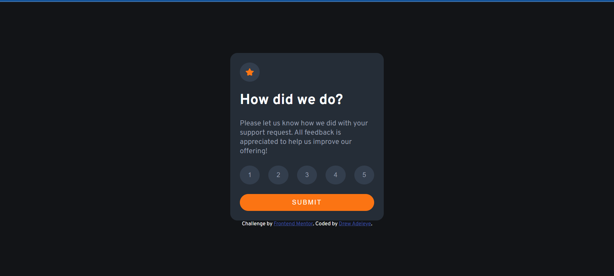

# Frontend Mentor - Interactive rating component solution

This is a solution to the [Interactive rating component challenge on Frontend Mentor](https://www.frontendmentor.io/challenges/interactive-rating-component-koxpeBUmI). Frontend Mentor challenges help you improve your coding skills by building realistic projects. 

## Table of contents

- [The challenge](#the-challenge)
- [Screenshot](#screenshot)
- [Links](#links)
- [Built with](#built-with)
- [Continued development](#continued-development)
- [Author](#author)
- [Acknowledgments](#acknowledgments)

### The challenge

Users should be able to:

- View the optimal layout for the app depending on their device's screen size
- See hover states for all interactive elements on the page
- Select and submit a number rating
- See the "Thank you" card state after submitting a rating

### Screenshot

### Links

- Solution URL: 
- Live Site URL: 

### Built with

- Semantic HTML5 markup
- CSS custom properties
- Flexbox
- JavaScript

### Continued development

This is was my very first javascript project. I learnt the basics of DOM manipulation, and the basic 
javascript syntax. I'm looking forward to build more javascript projects in the future.

## Author

- Website - [Drew Adeleye](https://www.youtube.com/channel/UCgfkqQmV5UJYAgY6fZjn70Q)
- Frontend Mentor - [@Drew-adeleye](https://www.frontendmentor.io/profile/Drew-adeleye)
- Twitter - [@_Andrewiiii](https://www.twitter.com/_Andrewiiii)

**Note: Delete this note and add/remove/edit lines above based on what links you'd like to share.**

## Acknowledgments

[tsbsankara](https://www.youtube.com/c/tsbsankara)